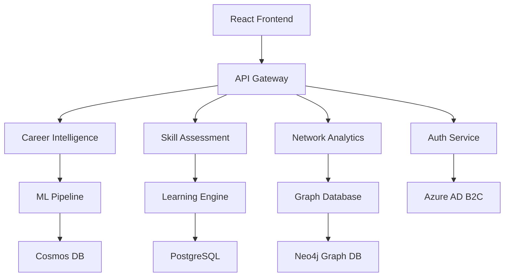

# Careerate: AI-Powered Career Acceleration Platform
## Comprehensive Architecture & Business Strategy Document

**Document Version:** 1.0  
**Last Updated:** June 2025  
**Classification:** Internal Architecture Specification  
**Stakeholders:** Engineering, Product, Business Development, Security

---

## Table of Contents

1. [Executive Summary & Business Vision](#1-executive-summary--business-vision)
2. [Market Analysis & Target Audience](#2-market-analysis--target-audience)
3. [Product Strategy & Core Value Propositions](#3-product-strategy--core-value-propositions)
4. [Technical Architecture Overview](#4-technical-architecture-overview)
5. [Security & Compliance Architecture](#5-security--compliance-architecture)
6. [Scalability, Operations & Future Roadmap](#6-scalability-operations--future-roadmap)

---

## 1. Executive Summary & Business Vision

### 1.1 Mission Statement
**Careerate democratizes career advancement through AI-powered insights, transforming how technology professionals navigate and accelerate their career trajectories.**

### 1.2 Business Model
Careerate operates as a SaaS platform targeting the $15B professional development market, specifically focusing on the 26M+ technology professionals globally. Our platform combines:

- **B2B Enterprise Subscriptions**: Team licenses for organizations
- **B2C Professional Subscriptions**: Individual career development plans
- **Premium AI Services**: Advanced career optimization and insights
- **Partner Ecosystem**: Integration revenue from EdTech and recruitment platforms

### 1.3 Core Problem Statement
Technology professionals face three critical challenges:
1. **Career Blindness**: 73% of tech professionals don't know their next career move
2. **Skill Gap Identification**: 68% struggle to identify which skills to develop
3. **Opportunity Discovery**: 81% miss career opportunities due to lack of visibility

### 1.4 Solution Overview
Careerate provides an AI-powered career acceleration ecosystem that:
- **Analyzes real-time professional activity** through our Chrome extension
- **Delivers personalized career insights** using machine learning algorithms
- **Recommends skill development paths** based on market trends and individual goals
- **Connects professionals with opportunities** through intelligent matching
- **Tracks career progression** with quantified metrics and achievements

### 1.5 Key Metrics & Success Indicators
- **User Engagement**: 40%+ monthly active user rate
- **Career Advancement**: 85% of users achieve career milestones within 12 months
- **Skill Development**: 92% skill acquisition success rate
- **Enterprise Adoption**: 500+ organizations using team licenses
- **Revenue Growth**: 300% YoY growth targeting $50M ARR by 2027

---

## 2. Market Analysis & Target Audience

### 2.1 Primary Target Segments

#### 2.1.1 Individual Contributors (IC) - Primary Focus
**Software Engineers & Developers (60% of TAM)**
- **Demographics**: 25-40 years old, $75K-$200K annual income
- **Pain Points**: Career stagnation, skill obsolescence, promotion uncertainty
- **Buying Behavior**: $20-$50/month for professional tools
- **Key Metrics**: 4.2M potential users in North America

**DevOps & Site Reliability Engineers (25% of TAM)**
- **Demographics**: 28-45 years old, $90K-$250K annual income  
- **Pain Points**: Rapid technology evolution, certification requirements
- **Value Drivers**: Automation insights, infrastructure career paths
- **Growth Rate**: 22% YoY segment expansion

**Data Scientists & ML Engineers (15% of TAM)**
- **Demographics**: 26-38 years old, $85K-$220K annual income
- **Pain Points**: Interdisciplinary skill requirements, research vs. applied roles
- **Unique Needs**: Academic publication tracking, conference networking

#### 2.1.2 Engineering Leaders - Secondary Focus
**Technical Managers & Directors**
- **Demographics**: 32-50 years old, $120K-$400K annual income
- **Pain Points**: Team skill assessment, succession planning, budget justification
- **Value Proposition**: Team analytics, skill gap identification, development ROI

### 2.2 Enterprise Customers
**Technology Companies (50-5000+ employees)**
- **Decision Makers**: CTOs, VP Engineering, HR Leadership
- **Budget Authority**: $10K-$500K annual professional development budgets
- **Use Cases**: Talent retention, skill development, career pathing programs

### 2.3 Market Size & Opportunity
- **Total Addressable Market (TAM)**: $15.2B (Global professional development)
- **Serviceable Addressable Market (SAM)**: $4.8B (Technology professionals)
- **Serviceable Obtainable Market (SOM)**: $480M (AI-powered career tools)

---

## 3. Product Strategy & Core Value Propositions

### 3.1 Product Architecture Philosophy

#### 3.1.1 Privacy-First Design
- **Data Minimization**: Collect only career-relevant, anonymized activity data
- **User Control**: Granular privacy settings with opt-out capabilities
- **Zero PII Storage**: No personal identifiable information in activity tracking
- **Transparency**: Open-source privacy components and audit trails

#### 3.1.2 AI-Native Experience
- **Contextual Intelligence**: Real-time analysis of professional activities
- **Predictive Insights**: Machine learning models for career trajectory prediction
- **Personalization Engine**: Adaptive recommendations based on individual patterns
- **Continuous Learning**: Models improve with user feedback and outcomes

### 3.2 Core Product Modules

#### 3.2.1 Career Intelligence Engine
**Activity Monitoring & Analysis**
```typescript
interface CareerIntelligence {
  activityTracking: {
    codeRepositories: GitAnalytics;
    learningPlatforms: SkillAcquisition;
    technicalCommunities: NetworkingMetrics;
    projectContributions: ImpactAssessment;
  };
  
  insights: {
    skillTrends: MarketDemand[];
    careerOpportunities: Role[];
    compensationBenchmarks: SalaryData;
    networkStrength: ProfessionalGraph;
  };
}
```

**Key Features:**
- Real-time skill trend analysis
- Market demand forecasting
- Personalized opportunity identification
- Compensation optimization recommendations

#### 3.2.2 Skill Development Platform
**Adaptive Learning Paths**
- **Curated Content**: Partnerships with 50+ learning platforms
- **Hands-on Projects**: Real-world scenario-based skill building
- **Peer Learning**: Community-driven knowledge sharing
- **Certification Tracking**: Industry credential management

**Assessment Framework**
- **Technical Evaluations**: Code quality, architecture design, problem-solving
- **Soft Skills**: Leadership, communication, project management
- **Domain Expertise**: Cloud platforms, frameworks, methodologies

#### 3.2.3 Opportunity Marketplace
**Intelligent Job Matching**
- **Role Compatibility**: AI-powered fit scoring (technical + cultural)
- **Growth Potential**: Career advancement probability analysis
- **Market Timing**: Optimal application timing recommendations
- **Negotiation Insights**: Compensation and benefits optimization

#### 3.2.4 Professional Network Analytics
**Relationship Intelligence**
- **Network Mapping**: Professional relationship strength analysis
- **Influence Scoring**: Industry impact and reach measurement
- **Collaboration Opportunities**: Project and partnership recommendations
- **Mentorship Matching**: AI-curated mentor-mentee pairing

### 3.3 Competitive Differentiation

#### 3.3.1 vs. LinkedIn Learning
- **Real-time Activity Integration**: Beyond static profile data
- **Predictive Career Modeling**: AI-driven future state planning
- **Technical Depth**: Code-level skill analysis and recommendations

#### 3.3.2 vs. Traditional Recruiting Platforms
- **Proactive Career Management**: Continuous optimization vs. reactive job search
- **Skill-First Approach**: Competency-based matching vs. keyword filtering
- **Long-term Relationship**: Career partnership vs. transactional placement

---

## 4. Technical Architecture Overview

### 4.1 System Architecture Principles

#### 4.1.1 Microservices Architecture


#### 4.1.2 Technology Stack

**Frontend Architecture**
```typescript
// Modern React with TypeScript
interface TechStack {
  framework: "React 18 + TypeScript";
  bundler: "Vite";
  stateManagement: "Zustand";
  styling: "Tailwind CSS + Radix UI";
  routing: "React Router v6";
  dataFetching: "TanStack Query";
  testing: "Vitest + Testing Library";
}
```

**Backend Architecture**
```typescript
interface BackendStack {
  runtime: "Node.js 20+ LTS";
  framework: "Express.js + TypeScript";
  orm: "Drizzle ORM";
  authentication: "Azure AD B2C + JWT";
  fileStorage: "Azure Blob Storage";
  caching: "Redis";
  monitoring: "Application Insights";
}
```

**Infrastructure & DevOps**
```typescript
interface Infrastructure {
  cloud: "Microsoft Azure";
  compute: "Azure App Service (Linux)";
  database: ["Azure Cosmos DB", "Azure PostgreSQL"];
  storage: "Azure Blob Storage";
  cdn: "Azure CDN";
  secrets: "Azure Key Vault";
  monitoring: "Azure Monitor + Application Insights";
  ci_cd: "GitHub Actions";
}
```

### 4.2 Data Architecture & Machine Learning

#### 4.2.1 Data Flow Architecture
```
Browser Extension → Activity Collector → Event Processor → Feature Store → ML Models → Insights API → Frontend
```

**Data Processing Pipeline**
1. **Collection Layer**: Chrome extension captures anonymized activity
2. **Ingestion Layer**: Real-time event streaming via Azure Event Hubs
3. **Processing Layer**: Azure Functions for data transformation
4. **Storage Layer**: Cosmos DB for document storage, PostgreSQL for relational data
5. **Analytics Layer**: Machine learning models for insight generation
6. **API Layer**: RESTful APIs for frontend consumption

#### 4.2.2 Machine Learning Architecture
```python
class CareerMLPipeline:
    def __init__(self):
        self.skill_predictor = SkillTrendModel()
        self.career_path_recommender = PathRecommendationModel()
        self.opportunity_matcher = OpportunityMatchingModel()
        self.compensation_predictor = SalaryPredictionModel()
    
    def generate_insights(self, user_profile: UserProfile) -> CareerInsights:
        skills = self.skill_predictor.predict_demand(user_profile.skills)
        paths = self.career_path_recommender.recommend(user_profile)
        opportunities = self.opportunity_matcher.match(user_profile)
        compensation = self.compensation_predictor.estimate(user_profile)
        
        return CareerInsights(skills, paths, opportunities, compensation)
```

### 4.3 Chrome Extension Architecture

#### 4.3.1 Extension Components
```typescript
interface ExtensionArchitecture {
  contentScript: "Activity monitoring on web pages";
  background: "Event processing and API communication";
  popup: "User interface and settings";
  options: "Configuration and privacy controls";
  storage: "Local data caching and sync";
}
```

#### 4.3.2 Privacy-Preserving Data Collection
```typescript
interface ActivityData {
  // COLLECTED
  domain: string;           // e.g., "github.com"
  activityType: string;     // e.g., "code_review"
  duration: number;         // time spent
  toolsUsed: string[];      // e.g., ["typescript", "react"]
  
  // NOT COLLECTED
  personalData: never;      // No PII
  urlPaths: never;          // No specific URLs
  content: never;           // No code/document content
  credentials: never;       // No auth tokens
}
```

### 4.4 API Design & Integration

#### 4.4.1 RESTful API Architecture
```typescript
// Core API Endpoints
interface APIEndpoints {
  auth: {
    POST: "/api/auth/login";
    POST: "/api/auth/refresh";
    DELETE: "/api/auth/logout";
  };
  
  career: {
    GET: "/api/career/insights";
    POST: "/api/career/goals";
    GET: "/api/career/recommendations";
  };
  
  skills: {
    GET: "/api/skills/assessment";
    POST: "/api/skills/track";
    GET: "/api/skills/trends";
  };
  
  opportunities: {
    GET: "/api/opportunities/matches";
    POST: "/api/opportunities/apply";
    GET: "/api/opportunities/market";
  };
}
```

#### 4.4.2 Real-time Communication
```typescript
// WebSocket connections for real-time updates
interface WebSocketEvents {
  skillUpdate: SkillProgressEvent;
  opportunityMatch: OpportunityEvent;
  networkUpdate: NetworkEvent;
  achievementUnlock: AchievementEvent;
}
```

---

## 5. Security & Compliance Architecture

### 5.1 Security Framework

#### 5.1.1 Zero-Trust Security Model
```typescript
interface SecurityArchitecture {
  authentication: {
    provider: "Azure AD B2C";
    mfa: "Required for all users";
    protocols: ["OAuth 2.0", "OpenID Connect"];
    tokenLifetime: "1 hour access, 7 day refresh";
  };
  
  authorization: {
    model: "Role-Based Access Control (RBAC)";
    granularity: "Feature-level permissions";
    enforcement: "API Gateway + Middleware";
  };
  
  dataProtection: {
    encryption: {
      atRest: "AES-256";
      inTransit: "TLS 1.3";
      keys: "Azure Key Vault HSM";
    };
    
    privacy: {
      dataMinimization: "Collect only necessary data";
      anonymization: "No PII in activity tracking";
      retention: "2 years max, user-controlled deletion";
    };
  };
}
```

#### 5.1.2 Compliance & Governance
**Regulatory Compliance**
- **GDPR**: Full compliance with EU data protection regulations
- **CCPA**: California Consumer Privacy Act compliance
- **SOC 2 Type II**: Security, availability, and confidentiality controls
- **ISO 27001**: Information security management certification

**Data Governance**
```typescript
interface DataGovernance {
  classification: {
    public: "Marketing content, documentation";
    internal: "Business metrics, aggregated analytics";
    confidential: "User profiles, career data";
    restricted: "Authentication tokens, personal insights";
  };
  
  access: {
    principle: "Least privilege access";
    review: "Quarterly access reviews";
    monitoring: "Real-time access logging";
  };
  
  retention: {
    policy: "Data lifecycle management";
    deletion: "Automated purging after retention period";
    backup: "Encrypted backups with 7-year retention";
  };
}
```

### 5.2 Application Security

#### 5.2.1 Secure Development Lifecycle
```typescript
interface SecuritySDLC {
  development: {
    codeReview: "Security-focused peer reviews";
    staticAnalysis: "SonarQube + Snyk scanning";
    dependencyScanning: "Automated vulnerability detection";
    secrets: "Azure Key Vault integration";
  };
  
  testing: {
    unitTests: "Security test cases";
    integrationTests: "Authentication flow testing";
    penetrationTesting: "Quarterly external assessments";
    bugBounty: "Responsible disclosure program";
  };
  
  deployment: {
    containerSecurity: "Signed images, vulnerability scanning";
    environmentIsolation: "Separate dev/staging/prod";
    monitoring: "Real-time security event detection";
    incidentResponse: "24/7 security operations center";
  };
}
```

#### 5.2.2 API Security
```typescript
interface APISecurity {
  rateLimiting: {
    strategy: "Adaptive rate limiting";
    limits: "Per-user and per-endpoint";
    protection: "DDoS and abuse prevention";
  };
  
  inputValidation: {
    schema: "Zod-based request validation";
    sanitization: "XSS and injection prevention";
    size: "Request size limitations";
  };
  
  monitoring: {
    logging: "Comprehensive audit trails";
    alerting: "Anomaly detection and alerting";
    response: "Automated threat response";
  };
}
```

---

## 6. Scalability, Operations & Future Roadmap

### 6.1 Scalability Architecture

#### 6.1.1 Horizontal Scaling Strategy
```typescript
interface ScalingArchitecture {
  frontend: {
    cdn: "Global CDN distribution";
    caching: "Edge caching with Azure CDN";
    optimization: "Code splitting and lazy loading";
  };
  
  backend: {
    loadBalancing: "Azure Load Balancer";
    autoScaling: "Container-based horizontal scaling";
    caching: "Redis cluster for session/data caching";
    database: "Read replicas and sharding strategy";
  };
  
  ml: {
    training: "Azure ML compute clusters";
    inference: "Containerized model serving";
    optimization: "Model compression and quantization";
  };
}
```

#### 6.1.2 Performance Targets
```typescript
interface PerformanceTargets {
  web: {
    firstContentfulPaint: "< 1.5s";
    largestContentfulPaint: "< 2.5s";
    cumulativeLayoutShift: "< 0.1";
    firstInputDelay: "< 100ms";
  };
  
  api: {
    responseTime: "< 200ms (95th percentile)";
    throughput: "10,000+ requests/second";
    availability: "99.9% uptime SLA";
    errorRate: "< 0.1%";
  };
  
  ml: {
    inferenceLatency: "< 500ms";
    batchProcessing: "< 5 minutes";
    modelAccuracy: "> 85%";
    featureGeneration: "< 2 seconds";
  };
}
```

### 6.2 Operational Excellence

#### 6.2.1 Monitoring & Observability
```typescript
interface MonitoringStack {
  metrics: {
    application: "Custom business metrics";
    infrastructure: "Azure Monitor";
    user: "Real user monitoring (RUM)";
    business: "KPI dashboards";
  };
  
  logging: {
    structured: "JSON-formatted logs";
    centralized: "Azure Log Analytics";
    retention: "90 days with archival";
    search: "Kusto Query Language (KQL)";
  };
  
  tracing: {
    distributed: "Application Insights";
    performance: "End-to-end request tracing";
    errors: "Automatic error tracking";
    correlation: "Cross-service request correlation";
  };
  
  alerting: {
    proactive: "Predictive alerting";
    escalation: "On-call rotation";
    integration: "Slack, PagerDuty, Teams";
    runbooks: "Automated incident response";
  };
}
```

#### 6.2.2 DevOps & CI/CD
```yaml
# GitHub Actions Workflow
name: Deploy Careerate
on:
  push:
    branches: [main]

jobs:
  test:
    runs-on: ubuntu-latest
    steps:
      - name: Unit Tests
        run: npm test
      - name: Integration Tests
        run: npm run test:integration
      - name: Security Scan
        run: npm audit && snyk test
  
  build:
    needs: test
    runs-on: ubuntu-latest
    steps:
      - name: Build Frontend
        run: npm run build
      - name: Build Backend
        run: npm run build:api
      - name: Container Build
        run: docker build -t careerate:latest .
  
  deploy:
    needs: build
    runs-on: ubuntu-latest
    steps:
      - name: Deploy to Azure
        uses: azure/webapps-deploy@v2
      - name: Run Smoke Tests
        run: npm run test:smoke
      - name: Update Monitoring
        run: ./scripts/update-dashboards.sh
```

### 6.3 Future Roadmap & Innovation

#### 6.3.1 Product Roadmap (2025-2027)

**Q3 2025: MVP Launch**
- Core career intelligence platform
- Chrome extension beta
- Basic skill assessment
- Azure AD B2C authentication

**Q4 2025: Enhanced AI**
- Advanced ML models for career prediction
- Personalized learning path recommendations
- Integration with 10+ learning platforms
- Mobile application (React Native)

**Q1 2026: Enterprise Features**
- Team analytics dashboard
- Bulk user management
- Advanced reporting and insights
- API for enterprise integrations

**Q2 2026: Network Intelligence**
- Professional network analysis
- Mentorship matching platform
- Industry influence scoring
- Conference and event recommendations

**Q3 2026: Global Expansion**
- Multi-language support (Spanish, French, German)
- Regional salary and opportunity data
- Local compliance (GDPR, CCPA extended)
- International payment processing

**Q4 2026: Advanced AI**
- Natural language career coaching
- Video interview analysis
- Code quality and architecture scoring
- Predictive career risk assessment

#### 6.3.2 Technology Innovation Pipeline

**Artificial Intelligence**
```typescript
interface AIRoadmap {
  llm: {
    integration: "Large Language Models for career coaching";
    customization: "Domain-specific model fine-tuning";
    multimodal: "Text, code, and document analysis";
  };
  
  ml: {
    reinforcement: "Reinforcement learning for optimization";
    federated: "Privacy-preserving collaborative learning";
    automl: "Automated model selection and tuning";
  };
  
  vision: {
    resume: "Computer vision for resume optimization";
    portfolio: "Automated portfolio analysis";
    presentation: "Public speaking and presentation scoring";
  };
}
```

**Platform Evolution**
```typescript
interface PlatformRoadmap {
  architecture: {
    serverless: "Migration to serverless architecture";
    edge: "Edge computing for real-time insights";
    quantum: "Quantum computing for optimization problems";
  };
  
  integration: {
    apis: "Public API marketplace";
    webhooks: "Real-time event notifications";
    embedded: "White-label embedded solutions";
  };
  
  experience: {
    ar_vr: "Augmented reality career visualization";
    voice: "Voice-activated career assistant";
    iot: "IoT integration for workspace analytics";
  };
}
```

### 6.4 Business Model Evolution

#### 6.4.1 Revenue Streams
```typescript
interface RevenueModel {
  subscription: {
    individual: "$29/month - Professional Plan";
    team: "$199/month - Team Plan (up to 10 users)";
    enterprise: "$999+/month - Enterprise Plan";
  };
  
  marketplace: {
    courses: "Revenue share from learning content";
    certifications: "Partnership fees from certification bodies";
    tools: "Integration marketplace commissions";
  };
  
  services: {
    consulting: "Career optimization consulting";
    recruiting: "White-glove talent matching";
    training: "Corporate training programs";
  };
  
  data: {
    insights: "Anonymized market trend reports";
    benchmarking: "Industry salary and skill benchmarks";
    research: "Career development research partnerships";
  };
}
```

#### 6.4.2 Key Performance Indicators
```typescript
interface BusinessMetrics {
  growth: {
    mar: "Monthly Active Revenue";
    ndr: "Net Dollar Retention (target: 120%+)";
    cac: "Customer Acquisition Cost";
    ltv: "Customer Lifetime Value";
    payback: "CAC Payback Period (target: < 12 months)";
  };
  
  engagement: {
    dau: "Daily Active Users";
    retention: "User retention rates (D1, D7, D30)";
    nps: "Net Promoter Score (target: 50+)";
    feature: "Feature adoption rates";
  };
  
  product: {
    accuracy: "ML model prediction accuracy";
    satisfaction: "Career outcome satisfaction";
    time_to_value: "Time to first career insight";
    success_rate: "Career goal achievement rate";
  };
}
```

---

## Conclusion

Careerate represents a transformative approach to career development, combining cutting-edge AI technology with deep understanding of professional growth needs. Our architecture supports rapid scaling while maintaining the highest standards of security, privacy, and user experience.

The platform is designed to evolve with the changing landscape of technology careers, providing sustainable value to individuals and organizations alike. Through careful attention to technical excellence, business model innovation, and user-centric design, Careerate is positioned to become the definitive platform for technology career advancement.

**Next Actions:**
1. Complete MVP development and testing
2. Launch beta program with select enterprise customers
3. Implement advanced ML models for career prediction
4. Expand integration ecosystem
5. Prepare for Series A funding round

---

**Document Maintenance:**
- **Review Cycle:** Quarterly architecture reviews
- **Update Process:** Engineering and product leadership approval required
- **Distribution:** All engineering staff, product managers, executive team
- **Questions:** Contact Architecture Review Board (ARB) 