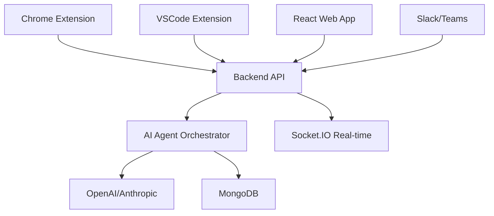

# 🚀 CAREERATE - AI PAIR PROGRAMMING PLATFORM FOR DEVOPS

> **The Complete AI Assistant for DevOps Teams**  
> Real-time AI collaboration across Web, Chrome, VSCode, and Slack/Teams

[](https://www.typescriptlang.org/)
[](https://reactjs.org/)
[](https://nodejs.org/)
[](https://openai.com/)
[](https://azure.microsoft.com/)

---

## 🎯 **WHAT IS CAREERATE?**

Careerate is a **complete AI pair programming platform** specifically designed for DevOps and SRE teams. It provides intelligent assistance across multiple platforms with specialized AI agents for different infrastructure domains.

### **🌟 Key Features**
- **🤖 Specialized AI Agents** - Terraform, Kubernetes, AWS, Monitoring, Incident Response
- **⚡ Real-time Collaboration** - Team-based AI assistance with context sharing
- **🔌 Multi-Platform** - Web app, Chrome extension, VSCode extension, Slack/Teams
- **📊 Analytics Dashboard** - Track productivity, usage patterns, and team insights
- **🔒 Privacy-First** - Client-side data classification and granular consent
- **🎨 Modern UI** - Beautiful React interface with Tailwind CSS and Framer Motion

---

## 🚀 **QUICK START** (5 minutes)

### **1. Start the Backend**
```bash
git clone <repository-url>
cd backend
npm install
cp .env.example .env
npm run dev
```

### **2. Start the Frontend**
```bash
cd frontend
npm install
npm run dev
```

### **3. Open & Test**
- Navigate to http://localhost:3000
- Click "Get Started" to access the AI chat
- Try asking: *"Help me create a Terraform configuration for AWS"*

**🎉 That's it! You now have a working AI DevOps assistant.**

---

## 🎬 **DEMO SCENARIOS**

### **Terraform Help**
```
User: "Create a Terraform configuration for an EC2 instance with security group"
AI: [Provides complete .tf file with best practices]
```

### **Kubernetes Troubleshooting**
```
User: "My pods are in CrashLoopBackOff state"
AI: [Walks through kubectl debugging steps and common solutions]
```

### **AWS Cost Optimization**
```
User: "How can I reduce my AWS costs?"
AI: [Provides specific recommendations and CloudWatch queries]
```

---

## 🏗️ **ARCHITECTURE**



### **🧠 AI Agent System**
- **Terraform Agent** - Infrastructure as Code expertise
- **Kubernetes Agent** - Container orchestration specialist  
- **AWS Agent** - Cloud services and architecture
- **Monitoring Agent** - Observability and alerting
- **Incident Agent** - Emergency response and troubleshooting
- **General Agent** - DevOps best practices and automation

---

## 📱 **MULTI-PLATFORM PRESENCE**

### **🌐 Web Application**
- Full-featured dashboard and analytics
- Real-time AI chat with streaming responses
- Team collaboration and workspace management
- Comprehensive settings and preferences

### **🔌 Chrome Extension**
- Context collection from GitHub, AWS Console, GCP, etc.
- "Ask AI" button injection on supported sites
- Privacy-first data classification
- Seamless integration with web services

### **💻 VSCode Extension**
- Integrated AI assistance while coding
- Code explanation, generation, and review
- Error troubleshooting with context
- Embedded chat panel

### **💬 Slack/Teams Integration**
- Slash commands: `/careerate`, `/troubleshoot`
- Interactive buttons and modal dialogs
- Team-wide AI assistance
- Incident response workflows

---

## 🔧 **TECHNICAL STACK**

### **Frontend**
- **React 18** with TypeScript
- **Vite** for fast development and building
- **Tailwind CSS** for styling
- **Framer Motion** for animations
- **Socket.IO** for real-time communication
- **Zustand** for state management
- **50+ shadcn/ui components**

### **Backend**
- **Node.js** with Express and TypeScript
- **Socket.IO** for WebSocket communication
- **MongoDB** with Mongoose for data persistence
- **JWT** authentication with session management
- **OpenAI/Anthropic** API integration
- **Comprehensive security** (Helmet, CORS, Rate Limiting)

### **AI & Integrations**
- **OpenAI GPT-4** for advanced reasoning
- **Anthropic Claude** as alternative AI provider
- **LangChain** for AI workflow orchestration
- **Model Context Protocol** for tool integration
- **Azure B2C** for enterprise authentication

---

## 🔒 **SECURITY & PRIVACY**

### **Privacy-First Design**
- ✅ Client-side data classification
- ✅ Granular user consent management
- ✅ Automatic sensitive data filtering
- ✅ Configurable privacy levels
- ✅ Local data processing where possible

### **Enterprise Security**
- ✅ JWT-based authentication
- ✅ Azure B2C integration
- ✅ Rate limiting and DDoS protection
- ✅ Secure API key management
- ✅ HTTPS/TLS encryption
- ✅ Audit logging and monitoring

---

## 📊 **ANALYTICS & INSIGHTS**

### **Individual Analytics**
- Personal productivity metrics
- AI usage patterns and trends
- Time saved and efficiency gains
- Learning and skill development

### **Team Analytics**
- Collaboration effectiveness
- Knowledge sharing patterns
- Common issues and solutions
- Team productivity scoring

### **Enterprise Insights**
- Organization-wide AI adoption
- Cost savings and ROI tracking
- Skill gap identification
- Performance benchmarking

---

## 🚀 **DEPLOYMENT OPTIONS**

### **🏠 Local Development**
```bash
# Minimum setup - works immediately
npm run dev:backend
npm run dev:frontend
```

### **☁️ Azure Cloud** (Recommended)
- **Azure App Service** for backend
- **Azure Static Web Apps** for frontend  
- **Azure B2C** for authentication
- **Azure Key Vault** for secrets
- **One-click deployment** scripts included

### **🐳 Docker**
```bash
docker-compose up
# Complete stack with MongoDB
```

### **🔧 Custom Infrastructure**
- Kubernetes manifests included
- Terraform configurations provided
- CI/CD pipeline templates (GitHub Actions, Azure DevOps)

---

## 🎓 **GETTING STARTED**

### **For Developers**
1. **Read**: [DEPLOYMENT_GUIDE.md](./DEPLOYMENT_GUIDE.md)
2. **Follow**: Quick start instructions above
3. **Explore**: Try different AI agents and features
4. **Customize**: Add your own agents or integrations

### **For Teams**
1. **Deploy**: Use Azure one-click deployment
2. **Configure**: Set up team workspaces and permissions
3. **Integrate**: Connect Slack/Teams for team-wide AI
4. **Monitor**: Use analytics to track adoption and ROI

### **For Enterprises**
1. **Pilot**: Start with small team deployment
2. **Scale**: Expand to organization-wide rollout
3. **Customize**: Add custom agents for your infrastructure
4. **Measure**: Track productivity improvements and cost savings

---

## 🛠️ **CUSTOMIZATION**

### **Add Custom AI Agents**
```typescript
// Example: Create a custom agent for your infrastructure
const customAgent = {
  name: 'MyCompany DevOps',
  prompt: 'You are an expert in MyCompany infrastructure...',
  tools: ['kubectl', 'terraform', 'custom-cli']
};
```

### **Integrate with Your Tools**
```typescript
// Example: Add custom tool integration
const customTool = new MCPServer({
  name: 'company-monitoring',
  description: 'Interface with company monitoring systems',
  tools: [/* your custom tools */]
});
```

---

## 📈 **ROADMAP**

### **🎯 Current Version (v1.0)**
- ✅ Complete AI chat with specialized agents
- ✅ Real-time collaboration
- ✅ Multi-platform presence (Web, Chrome, VSCode)
- ✅ Analytics dashboard
- ✅ Privacy-first architecture

### **🚀 Coming Soon (v1.1)**
- 🔄 Advanced MCP server ecosystem
- 🔄 More AI providers (Gemini, Mistral)
- 🔄 Enhanced Slack/Teams integration
- 🔄 Mobile app support
- 🔄 Advanced analytics and reporting

### **🌟 Future Vision (v2.0)**
- 🔮 Autonomous incident response
- 🔮 Predictive infrastructure monitoring
- 🔮 AI-driven capacity planning
- 🔮 Custom model fine-tuning
- 🔮 Advanced workflow automation

---

## 🤝 **CONTRIBUTING**

We welcome contributions! Please see:
- [CONTRIBUTING.md](./CONTRIBUTING.md) - How to contribute
- [CODE_OF_CONDUCT.md](./CODE_OF_CONDUCT.md) - Community guidelines
- [ARCHITECTURE.md](./ARCHITECTURE.md) - Technical deep dive

---

## 📞 **SUPPORT**

### **Community**
- 💬 [GitHub Discussions](https://github.com/careerate/discussions)
- 🐛 [Issue Tracker](https://github.com/careerate/issues)
- 📖 [Documentation](https://docs.careerate.dev)

### **Enterprise**
- 📧 enterprise@careerate.dev
- 🏢 Custom deployment assistance
- 📈 Training and onboarding
- 🔧 Custom agent development

---

## 📄 **LICENSE**

This project is licensed under the MIT License - see the [LICENSE](LICENSE) file for details.

---

## 🙏 **ACKNOWLEDGMENTS**

- **OpenAI** and **Anthropic** for AI capabilities
- **Microsoft Azure** for cloud infrastructure
- **LangChain** for AI orchestration
- **React** and **Node.js** ecosystems
- **Open source community** for foundational tools

---

<div align="center">

**🚀 Ready to revolutionize your DevOps workflow?**

[**🎬 Watch Demo**](https://demo.careerate.dev) • [**📚 Read Docs**](https://docs.careerate.dev) • [**☁️ Deploy Now**](https://deploy.careerate.dev)

---

Made with ❤️ by the Careerate Team

**Star ⭐ this repo if it helped you!**

</div>